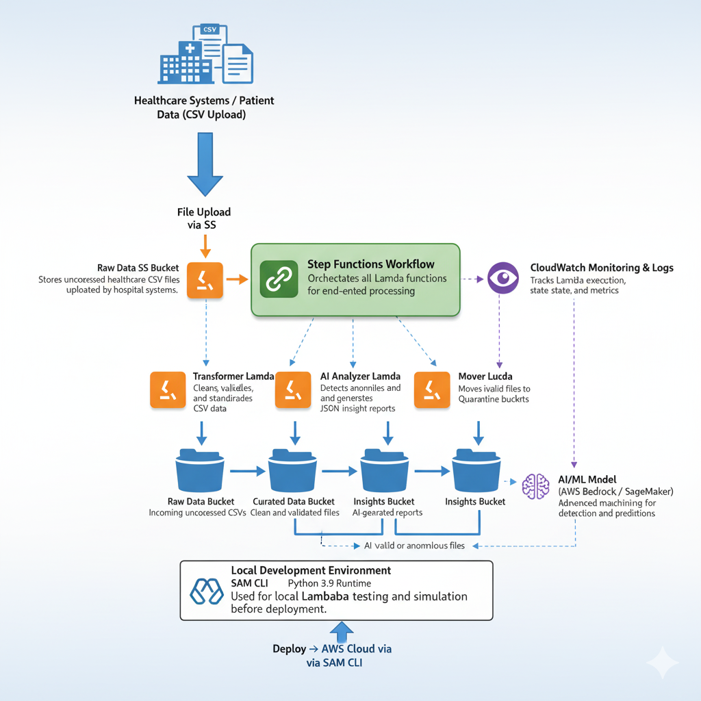

# healthcare_data_quality_pipeline  
# 🩺 End-to-End Healthcare Data Quality & AI Insights Pipeline  
# Building a Serverless Data Engineering Solution with AWS Lambda, Step Functions, and S3  

🔥 **Introduction**

This repository showcases how to design and deploy a **modern, serverless data engineering pipeline** on AWS for automated healthcare data validation and AI-powered insights.  
The architecture integrates **AWS Lambda**, **Step Functions**, and **S3** to build a scalable, event-driven workflow capable of cleansing, validating, and analyzing healthcare data without managing any servers.

With its modular and automated design, this solution ensures:

- Continuous event-based data validation and cleansing.  
- AI-driven anomaly detection for accurate insights.  
- Serverless scalability with zero maintenance.  
- A full end-to-end data lifecycle — from ingestion to insights.

Whether you’re a **data engineer**, **cloud architect**, or **AI developer**, this project demonstrates a complete AWS-native solution for healthcare-grade data pipelines.

---

## 📊 Project Architecture



---

## 💡 Why This Architecture Matters

In the healthcare industry, **data quality directly impacts analytics and decision-making**.  
Manual ETL processes are slow, inconsistent, and hard to scale when dealing with large datasets.  

This serverless architecture provides:

- ⚡ **Event-driven automation:** Trigger workflows automatically when new data is uploaded.  
- 🧹 **Data quality enforcement:** Cleans and validates healthcare records using Python and Pandas.  
- 🧠 **AI anomaly detection:** Flags invalid or unusual data (e.g., wrong ages, invalid discharge dates).  
- ☁️ **Serverless scalability:** AWS manages all compute — no infrastructure to maintain.  
- 🔒 **Secure and compliant:** IAM policies and S3 encryption ensure data safety.  

---

## 🧩 Pipeline Overview

The pipeline is divided into several AWS-native components:

1. **Raw S3 Bucket** – Receives new patient record CSV uploads.  
2. **Initiator Lambda** – Detects new uploads and triggers the Step Function workflow.  
3. **Transformer Lambda** – Cleans and validates raw CSV data.  
4. **AI Analyzer Lambda** – Runs anomaly detection and generates JSON insight reports.  
5. **Mover Lambda** – Moves invalid files to the Quarantine bucket.  
6. **Curated S3 Bucket** – Stores clean, validated healthcare data.  
7. **Insights S3 Bucket** – Stores AI-generated reports summarizing data quality metrics.  

---

## ⚙️ Pipeline Components

### **Initiator Lambda**
- Invoked automatically by S3 upload events.  
- Starts the Step Function workflow.  

### **Transformer Lambda**
- Reads raw CSVs from S3.  
- Cleans and standardizes data (e.g., fixes columns, removes nulls).  
- Writes curated data to the Curated bucket.  

### **AI Analyzer Lambda**
- Scans curated data for invalid or abnormal values.  
- Generates structured JSON reports summarizing data anomalies.  
- Writes reports to the Insights bucket.  

### **Mover Lambda**
- Moves invalid or rejected data files to the Quarantine bucket for review.  

### **Step Function**
- Orchestrates the end-to-end flow:  
  `Initiator → Transformer → AI Analyzer → Mover (if needed)`

---

## 🧠 Example Insight Report

```json
{
  "file": "patient_records.csv",
  "timestamp": "2025-10-23T19:05:00Z",
  "records": 500,
  "anomalies_detected": 3,
  "fields_flagged": ["age", "discharge_date"],
  "sample_anomalies": [
    {"row": 23, "reason": "age_out_of_range"},
    {"row": 45, "reason": "discharge_before_admission"}
  ]
}
